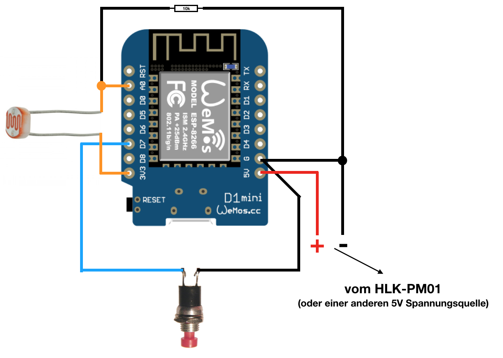
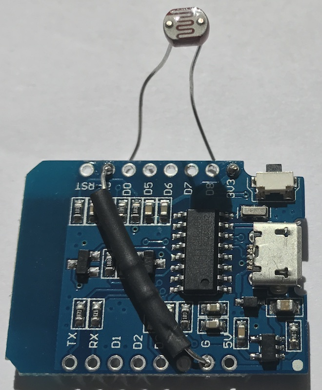
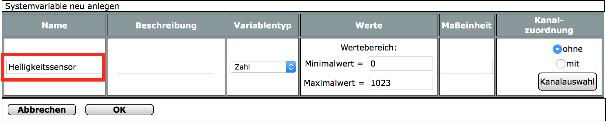
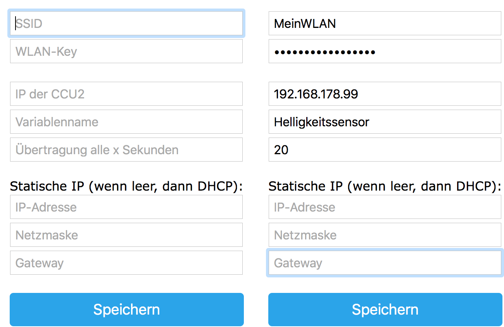

# WemosD1 HomeMatic Helligkeitssensor

## Zusammenfassung:
Der Sensor übermittelt in einem konfigurierbaren Intervall den Helligkeitswert (ca. 0...1023) an eine Variable der CCU2.

Bei Tests mit dem LDR in absoluter Dunkelheit lag der Wert bei ca. 7, in praller Sonne bei ca. 1000.


_(Genauere Werte sind zB mit einem BH1750 Helligkeitssensor statt eines einfachen Photowiderstands (LDR) erreichbar, jedoch hatte ich zum Zeitpunkt des Projekts noch einige LDR zu liegen... Aber die Integration eines I2C BH1750 Helligkeitssensor-Moduls (ca. 2,29 EUR) ist in Arbeit und wird fertiggestellt, sobald mir das Bauteil geliefert wurde.)_


## Teileliste:
- 1x [Wemos D1 mini](http://www.ebay.de/itm/272271662681) (ca. 3,29 EUR)
- 1x Stromversorgungsmodul, z.B. [HLK-PM01](http://www.ebay.de/itm/272521453807) (ca. 2,34 EUR) - oder ein 5V Netzteil mit microUSB
- 1x [LDR](http://www.ebay.de/itm/321957950526) (ca. 2,75 EUR / 20 Stück = 0,14 EUR/Stk.)
- 1x [Widerstand 10k](http://www.ebay.de/itm/221833069520) (ca. 1,49 EUR / 10 Stück = 0,15 EUR/Stk.)
- 1x [Taster](http://www.ebay.de/itm/263057910534), wird jedoch nur zur (Erst-)Konfiguration benötigt
(_statt des Tasters kann man auch mit einer temporären Drahtbrücke arbeiten_) 

Die reinen Teilekosten liegen (ohne Gehäuse, div. Kleinkram :) und Anschlusskabel) somit bei ca. 6,- EUR.

## Verdrahtung:


**(Verdrahtung)**



**(Beispielaufbau (ohne Taster!))**

## Flashen
Wenn alles nach obigem Bild verdrahtet wurde, kann das Image ```WemosD1_HomeMatic_Helligkeitssensor.ino.d1_mini.bin``` auf den Wemos geflasht werden.

#### Vorgehensweise:
1. Voraussetzungen:
  - CH340-Treiber installieren ([Download-Seite des Herstellers](https://wiki.wemos.cc/downloads))
  - [esptool](https://github.com/igrr/esptool-ck/releases) herunterladen
2. Die Dateien esptool.exe und WemosD1_HomeMatic_Helligkeitssensor.ino.d1_mini.bin am besten in einem gemeinsamen Verzeichnis ablegen
3. WemosD1 mit einem microUSB-Kabel an den PC anschließen
4. Bezeichnung des neuen COM-Ports im Gerätemanager notieren (z.B. COM5)
5. Flash-Vorgang durchführen: 
  - Windows Eingabeaufforderung öffnen
  - ins Verzeichnis von esptool/WemosD1_HomeMatic_Helligkeitssensor.ino.d1_mini.bin wechseln (cd c:\... usw.)
  - anschließend Flash-Vorgang starten mit
  
```esptool.exe -vv -cd nodemcu -cb 921600 -cp COM5 -ca 0x00000 -cf WemosD1_HomeMatic_Helligkeitssensor.ino.d1_mini.bin```


## Vorbereitung an der CCU
In der WebUI unter Einstellungen->Systemvariable ist eine Variable vom Typ Zahl anzulegen.
Beim Klick auf den Button 'Neu' öffnet sich ein Fenster zum Anlegen der Variable.


**(Anlegen einer Variable in der WebUI)**

## Konfiguration des Wemos D1
Um den Konfigurationsmodus zu starten, muss der Wemos D1 **mit gedrückt gehaltenem Taster gestartet** werden.
Die **blaue LED am Wifi-Modul blinkt kurz und leuchtet dann dauerhaft.**

**Der Konfigurationsmodus ist nun aktiv.**

Auf dem Handy oder Notebook sucht man nun nach neuen WLAN Netzen in der Umgebung. 

Es erscheint ein neues WLAN mit dem Namen "WemosD1-xx:xx:xx:xx:xx:xx"

Nachdem man sich mit diesem verbunden hat, öffnet sich automatisch das Konfigurationsportal.

Geschieht dies nicht automatisch nach ca. 10 Sekunden, ist im Browser die Seite http://192.168.4.1 aufzurufen.

**WLAN konfigurieren auswählen**

**SSID**: WLAN aus der Liste oben auswählen, oder SSID manuell eingeben

**WLAN-Key**: WLAN Passwort

**IP der CCU2**: IP-Adresse der CCU2

**Variablenname**: Name der Variable, die zuvor in der CCU2 angelegt wurde

**Übertragung alle x Sekunden**: Sende-Intervall

 


**(Konfiguration leer / Beispiel)**

